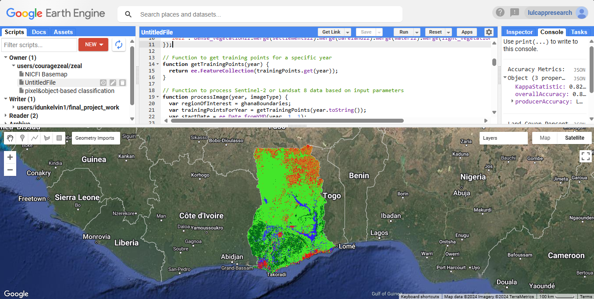

# Geospatial Land Use and Land Cover Classification of Ghana Using Machine Learning and Remote Sensing 

## Project Overview
This project performs Land Use and Land Cover (LULC) classification for Ghana using Google Earth Engine through both JavaScript (GEE Code Editor) and Python (geemap) implementations. It processes Sentinel-2 or Landsat 8 imagery and applies machine learning algorithms to classify land into different categories: dense vegetation, settlements, bareland, water, and light vegetation.

## Features
- Processes both Sentinel-2 and Landsat 8 imagery
- Implements multiple classification algorithms (CART, Random Forest, Naive Bayes, SVM)
- Performs accuracy assessment of the classification
- Allows for regional analysis by clipping the classification to specific areas
- Calculates land cover percentages for clipped regions
- Provides both JavaScript (GEE) and Python (geemap) implementations

## Requirements

### For JavaScript Implementation
- Google Earth Engine account
- Access to GEE Code Editor
- Basic knowledge of JavaScript and Earth Engine API

### For Python Implementation
```bash
pip install geemap earthengine-api numpy pandas
```

## Usage

### JavaScript (GEE Code Editor)
```javascript
// Example usage
var processedImageResult = processImage(2023, 'sentinel2');

// Perform classification
var ClassifiedImage = performClassification(
    processedImageResult.processedImage,
    processedImageResult.trainingPoints,
    'RandomForest'
);

// Print accuracy metrics
print('Accuracy Metrics:', ClassifiedImage.accuracyMetrics);
```

### Python (geemap)
```python
import ee
import geemap

# Initialize Earth Engine
ee.Initialize()
Map = geemap.Map()

# Process and classify image
processed_result = process_image(2023, 'sentinel2')
classified_image = perform_classification(
    processed_result['processed_image'],
    processed_result['training_points'],
    'RandomForest'
)
```

## Sample Results


## Code Structure

The repository contains two main implementations:

### `js/` directory
- `main.js`: Main JavaScript implementation for GEE Code Editor
- Supporting JavaScript modules

### `python/` directory
- `main.py`: Python implementation using geemap
- Supporting Python modules

## Functions Overview

### processImage()
```python
def process_image(year, image_type):
    """
    Processes satellite imagery based on specified parameters.
    
    Args:
        year (int): The year of interest
        image_type (str): 'sentinel2' or 'landsat8'
    
    Returns:
        dict: Processed image and training points
    """
```

### performClassification()
```python
def perform_classification(input_image, training_points, classification_algorithm):
    """
    Performs LULC classification on the input image.
    
    Args:
        input_image (ee.Image): The image to classify
        training_points (ee.FeatureCollection): Training data
        classification_algorithm (str): Algorithm to use
    
    Returns:
        dict: Classified image and accuracy metrics
    """
```

### clipImageByRegion()
```python
def clip_image_by_region(region_name, image):
    """
    Clips the classified image to a specific region.
    
    Args:
        region_name (str): Name of the region
        image (ee.Image): Classified image
    
    Returns:
        dict: Clipped image and land cover percentages
    """
```

## Visualization
The classification results use the following color scheme:
- Dense Vegetation: `#066c19`
- Settlements: `#e21313`
- Bareland: `#c58021`
- Water: `#321fff`
- Light Vegetation: `#43e62a`

## Customization
You can customize this project by:
- Adding more training data
- Implementing additional classification algorithms
- Modifying the visualization parameters
- Expanding the analysis to other regions or countries
- Adapting the code for different satellite sensors

## Contributing
1. Fork the repository
2. Create your feature branch (`git checkout -b feature/AmazingFeature`)
3. Commit your changes (`git commit -m 'Add some AmazingFeature'`)
4. Push to the branch (`git push origin feature/AmazingFeature`)
5. Open a Pull Request

## Contact
[courage]
[couragezeal544@gmail.com]

## Acknowledgments
- Google Earth Engine team
- geemap developers
- Contributors to the training dataset
